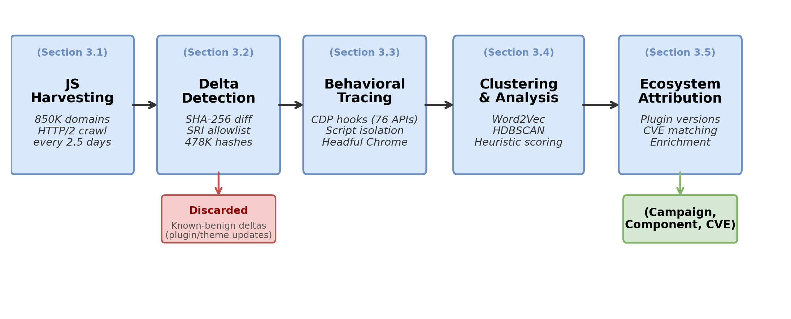

# Artifact: A Measurement Pipeline: From Payload to Plugin: Web-Scale Ecosystem Attribution of JavaScript Injection Campaigns.

This artifact accompanies the paper *“From Payload to Plugin: Web-Scale Ecosystem Attribution of JavaScript Injection Campaigns,”* accepted at ACM CCS 2026. It includes the crawling system, behavioral tracing harness, clustering and enrichment scripts, the complete analysis snapshots used to produce every table and figure in the paper, and the campaign findings metadata for the 20 campaigns observed during the 84-day study period.

## ScanCtr System
To run the main crawling and tracing system, follow the instructions in `code/crawling`

## Data redaction

Three categories of sensitive material are deliberately excluded from this artifact.

1. **Malicious JavaScript payloads** are withheld because redistributing live exploit code could enable reuse against unpatched sites.
2. **Victim domain lists** are withheld to avoid directing attention to sites that may still be compromised.
3. **Raw crawl data** (>100 GB) is withheld because it contains live URLs serving attacker-controlled content.

The bundled `data/campaigns` contains only `metadata.json` files with plugin fingerprints, version strings, CVE cross-references, and aggregate site counts.

## Ethical considerations and responsible disclosure 
* [CVE-2026-6287](https://www.cve.org/CVERecord?id=CVE-2026-6287)
* [IOC](https://otx.alienvault.com/user/ammoniaMe96/pulses)

